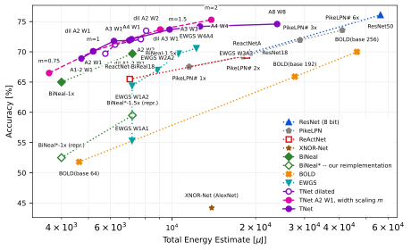

# Scalable Binary-Quantized Neural Networks for Energy-Efficient Vision (TNet)

Reference implementation for the paper

> **Scalable Binary-Quantized Neural Networks for Energy-Efficient Vision**
> Alexander Shekhovtsov and Štěpán Obdržálek, Czech Technical University in Prague.
> [ECML-PKDD 2026](https://ecmlpkdd.org/2026/) (research track).
> *Machine Learning and Knowledge Discovery in Databases. Research Track*, Lecture Notes
> in Computer Science, vol. 16943, Springer Nature Switzerland, Cham, pp. 253–270.
> doi:[10.1007/978-3-032-37664-0_15](https://doi.org/10.1007/978-3-032-37664-0_15)
> (published version; subscription required).

Project page: <https://cmp.felk.cvut.cz/~shekhovt/TNet/> — paper, BibTeX, slides and results.

A unified framework for training vision models with **integer weights and
activations** on a fixed quantization grid `{0, 1, …, K-1}` — no adaptive shift or
scale — that scales seamlessly down to **binary** (`K = 2`). Quantized weights are
trained directly rather than as a side effect of preserving real-valued signals.



**Updated and Extended Evaluation: Accuracy vs Total Energy Estimate.** Total energy per
image is weight and feature-map memory movement plus compute, priced at 7 nm. Every point
comes out of the same cost model, evaluated from each network's layer geometry and bit
widths rather than transcribed from its paper, so the methods are compared on one axis.
At about 70 % top-1, TNet costs 5.2 mJ per image against 77.4 mJ for a full-precision
ResNet-18 and 7.2 mJ for the strongest binary baseline at the same accuracy.

The other two views — accuracy against compute alone and against memory movement — and
the full table, with each row's memory and energy split out, are in
[`energy_ECML/results/README.md`](energy_ECML/results/README.md). What the model assumes
is in [`energy_ECML/docs/methodology.md`](energy_ECML/docs/methodology.md), and how each
prior method was placed on the same axis is in
[`energy_ECML/SOTA/`](energy_ECML/SOTA/README.md). All of it regenerates with
`python -m TNet.energy_ECML.report --all`.

## Highlights

- **One training scheme for all bit-widths.** The same code trains binary,
  ternary, and higher-integer weights/activations by changing `-W`/`-A`.
- **Elementary block** that removes the ad-hoc overparameterizations (RSign /
  RPReLU and redundant shifts) common in the binary-network literature, replacing
  them with a rationally designed initialization and per-layer learning rates.
- **Tower architecture** — a drop-in replacement for residual blocks that combines
  short and long connecting paths, giving the depth-scalability benefits of
  residual networks *without* propagating high-precision skip connections.
- **Sound gradient estimation.** Built on a stochastic-relaxation framework with a
  family of straight-through and sampling-based estimators (`ST`, `ST-det`, `ZGR`,
  `GS`, `RF`, …) that recover known heuristics as special cases.
- **Refined resource accounting** for compute, memory, and energy, correcting the
  ACE-v2 metric for low-bit operands (see `energy_ECML/`).

## Repository layout

| Path | Contents |
|------|----------|
| `train.py` | Training/evaluation entry point (CLI). |
| `methods.py` | Gradient-estimation methods (straight-through, score-function, Gumbel-Softmax, ZGR, …). |
| `layers.py` | Quantized layers, distributions, and quantization primitives. |
| `arch_imagenet.py` | Architectures: `QResNet18`, the **Tower** blocks, baselines (`resnet18`, MobileNet, Bi-Real/BOLD nets). |
| `training.py` | Training loop, schedulers, distillation, logging. |
| `setup_imagenet.py`, `setup_cifar.py`, `setup_mnist.py` | Dataset loaders (ImageNet via FFCV, CIFAR, MNIST). |
| `data_profiler.py` | Activation/gradient logging for analysis. |
| `energy_ECML/` | Energy & memory cost models and SOTA re-evaluation, as published at ECML-PKDD 2026. Frozen to that paper: `python -m TNet.energy_ECML.report --all` regenerates its table, plots and records. |
| `utilities/` | Op counting, weight loading, visualization, plotting helpers. |
| `experiments/` | Scripts reproducing the paper's figures and tables. |

## Installation

Requires Python 3.11+ and a CUDA-capable GPU.

Clone the repository:

```bash
git clone https://github.com/shekhovt/TNet.git
cd TNet
```

The scripts resolve their own package root by walking up to the nearest directory
containing a `.git`, `.package` or `.vscode` marker, which is what lets them be run both
as `python train.py` and as `python -m TNet.train`. A git clone therefore works as-is; if
you unpack an archive instead, create an empty `.package` file at the repository root.

### Recommended: virtual environment

```bash
# from inside the repository root
python3 -m venv .venv
source .venv/bin/activate
pip install torch torchvision --index-url https://download.pytorch.org/whl/cu128
pip install -r requirements.txt
```

Adjust the `cu128` index tag to match your CUDA version (e.g. `cu126`), or drop the
`--index-url` line entirely to take the default PyPI build.

`pip install -r requirements.txt` pulls in **everything TNet needs in one step**,
including [`relimport`](https://pypi.org/project/relimport/) (installed from PyPI; no
special access required). If you co-develop `relimport`, install it editable *after*
this step (`pip install -e /path/to/relimport`) so your checkout shadows the released
copy.

### Without a virtual environment (deprecated)

Installing into user packages still works but is not recommended — system Python
paths may shadow newer packages installed via pip:

```bash
pip install torch torchvision --index-url https://download.pytorch.org/whl/cu128
pip install -r requirements.txt
```

### Core dependencies

`torch` (≥ 2.7), `torchvision`, `numpy`, `scipy`, `matplotlib`, `pyparsing`,
`transformers`, `Pillow`, `nvitop`, and `relimport`. CIFAR and MNIST training,
and the whole of `energy_ECML/`, need nothing beyond these; `pytest` runs the
published test suite (`pytest energy_ECML/tests`).

### ImageNet: FFCV (optional, built from source)

ImageNet training uses [FFCV](https://ffcv.io) to read a `.beton`-cached copy of the
dataset. FFCV has no current binary wheel — its last release predates the torch, numpy
and numba versions used here — so it is built from source against a system OpenCV and
libjpeg-turbo. It builds and runs cleanly all the same; no source patches are needed.

Its pure-Python dependencies (`numba`, `terminaltables`, `pytorch_pfn_extras`,
`fastargs`, `assertpy`, `tqdm`, `psutil`, `opencv-python-headless`) are already in
`requirements.txt`, so only the C++ extension has to be built:

```bash
# System libraries the extension compiles against. On Debian/Ubuntu:
#   sudo apt install pkg-config libopencv-dev libturbojpeg0-dev
# On a module-based HPC system, load the equivalent modules instead, matching the
# compiler generation your Python was built with.

# from the repository root, with the virtual environment active:
git clone --depth 1 https://github.com/libffcv/ffcv.git ffcv_build
pip install --no-build-isolation --no-deps -e ./ffcv_build
```

`ffcv_build/` is ignored by this repository's `.gitignore`, so it can live inside the
checkout without being picked up by git.

`--no-deps` matters: FFCV's `setup.py` asks for `opencv-python`, whose wheel needs
`libGL.so.1` and fails to import on a headless machine. `requirements.txt` installs
`opencv-python-headless` instead — same `cv2` API, no GL dependency — and `--no-deps`
stops pip replacing it. `--no-build-isolation` lets the build see the numpy already in
your environment rather than fetching a different one.

If OpenCV comes from a module or a non-default prefix, its libraries must be on
`LD_LIBRARY_PATH` **when FFCV is imported**, not only when it is built; otherwise the
extension loads and then fails on a missing `libopencv_*.so`.

Verified with a full `DatasetWriter` → `.beton` → multi-worker `Loader` round-trip
against Python 3.12.3, torch 2.13.0, numpy 1.26.4, numba 0.66.0, OpenCV 4.11.0 and
libjpeg-turbo 3.0.1.

#### Where the dataset cache is written

`.beton` caches are written beside the dataset they were built from. Set
`TNET_CACHE_ROOT` to redirect them somewhere writable and shared — useful when the
dataset directory is read-only, or on a cluster where per-node scratch would rebuild the
cache for every job:

```bash
export TNET_CACHE_ROOT=/path/to/shared/cache
```

The source path is mirrored underneath that root, so caches for different datasets do
not collide.

## Quick start

`train.py` is the single entry point. Networks and datasets are specified as small
constructor strings, and weight/activation bit-widths are set with `-W`/`-A`
(the number of integer levels: `2` = binary, `4` = 2-bit, etc.).

Train a binary (W1/A1) Tower network on ImageNet-1k:

```bash
python train.py \
  --data 'imagenet(res=512)' --net 'QResNet18(gate=Tower8s)' \
  --method ST-det -n U --MD \
  -W 2 -A 2 \
  --batch_size 256 --epochs 200 --lr 0.005 \
  --distill --compile --cudagraph --fp16
```

Change the bit-width by varying `-W`/`-A` (e.g. `-W 4 -A 4` for 2-bit). Evaluate a
trained checkpoint:

```bash
python train.py --data 'imagenet(res=512)' --net 'QResNet18(gate=Tower8s)' \
  -W 2 -A 2 --method ST-det -n U --load best --test
```

### Smaller datasets

`imagenet-100(res=512)` and `imagenet-10(res=512)` train on the 100- and 10-class
subsets. MNIST and CIFAR-10 are available without any extra data setup; dataset
names are **case-sensitive**:

```bash
# MNIST — downloads automatically on first run
python train.py --data MNIST --net 'LeNetRQ()' \
  -W 2 -A 4 --method ST -n L --epochs 200 --batch_size 256 --MD

# CIFAR-10 — downloads automatically on first run
python train.py --data CIFAR --net 'ResNet18()' \
  -W 2 -A 4 --method ST -n L --epochs 200 --batch_size 256 --MD
```

Profile a network's compute/memory/energy cost (no data required — it is shape
arithmetic, and runs anywhere in a couple of seconds). `profile_networks.py` is
the front door to the `energy_ECML/` model: any configuration that trains can be
profiled by passing the same arguments.

```bash
python profile_networks.py                                      # default configuration
python profile_networks.py --net 'BiNealNet(m=1)' --method ST -A 2 -W 2
python profile_networks.py --layers --net 'QResNet18(gate=Tower8s)' --method ST -A 2 -W 2
```

It prints the weight and feature memory moved per image with the energy of
moving it, the compute energy, and the total. `--layers` adds the per-layer
breakdown. For the whole published comparison — every method, the three plots,
and a column-by-column diff against the paper's table:

```bash
python -m TNet.energy_ECML.report --all      # writes energy_ECML/results/
```

### Useful options

| Flag | Meaning |
|------|---------|
| `-W`, `-A` | Quantization levels per weight / activation (`0` = full precision). |
| `-m`, `--method` | Gradient estimator: `ST`, `ST-det`, `ZGR`, `GS(t=…)`, `RF(M=…)`, `ReLU`, `Clamp`, … |
| `-n`, `--noise` | Relaxation noise: `L` logistic, `U` uniform, `T` triangular, `N` Gaussian. |
| `--MD` | Mirror descent for the weights. |
| `--distill` | Train against a teacher's logits. |
| `--compile`, `--cudagraph`, `--fp16` | `torch.compile`, CUDA graphs, mixed precision. |
| `--load`, `--test` | Resume / evaluate (`best`, `last`, `final`). |

Run `python train.py --help` for the full list.

Results, checkpoints, and logs are written under `res/<data>-<net>-…/` (this
directory is git-ignored).

## Reproducing the paper

The `experiments/` directory contains the configurations behind the paper's
figures and tables — ImageNet-1k Pareto curves (`exp_imagenet1k.py`),
architecture/width scaling (`exp_arch_scaling.py`), estimator comparisons
(`exp_estimators.py`), convergence speed (`exp_convergence_speed.py`), and MNIST
ablations (`exp_MNIST.py`). Each file lists the exact `train.py` argument strings
used. Energy/memory re-evaluation of prior work lives in `energy_ECML/`, whose
generated table, plots and per-row provenance are in
[`energy_ECML/results/README.md`](energy_ECML/results/README.md).

`exp_arch_scaling.py` and `exp_imagenet1k.py` are the scripts that plot and
summarize the results for the paper's main experiments. Once the relevant
configs listed in them have been trained (their checkpoints and logs are present
under `res/`), running these scripts reads the results back and produces the
corresponding figures and summary tables.

## Citation

```bibtex
@inproceedings{shekhovtsov2026scalable,
  title     = {Scalable Binary-Quantized Neural Networks for Energy-Efficient Vision},
  author    = {Shekhovtsov, Alexander and Obdr{\v{z}}{\'a}lek, {\v{S}}t{\v{e}}p{\'a}n},
  booktitle = {Machine Learning and Knowledge Discovery in Databases. Research Track},
  series    = {Lecture Notes in Computer Science},
  volume    = {16943},
  pages     = {253--270},
  publisher = {Springer Nature Switzerland},
  address   = {Cham},
  year      = {2026},
  doi       = {10.1007/978-3-032-37664-0_15},
  isbn      = {978-3-032-37664-0}
}
```

Fields are Crossref's record for the DOI, plus the volume number from the proceedings
front matter (issued as LNAI 16943, a subseries of LNCS). A free authors' version of the
PDF is on the [project page](https://cmp.felk.cvut.cz/~shekhovt/TNet/).

## License

This work is licensed under the
[Creative Commons Attribution-NonCommercial-ShareAlike 4.0 International License](http://creativecommons.org/licenses/by-nc-sa/4.0/)
(CC BY-NC-SA 4.0). See [`LICENSE`](LICENSE) for the full text.
