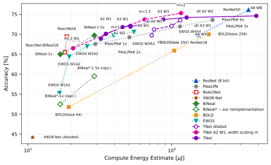
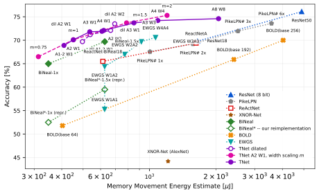

# Energy evaluation — all methods, one code path

Status: GENERATED by `python -m TNet.energy_ECML.report --all` — every figure below comes out of the model, none is transcribed. **Do not edit by hand**; edit the registry in `energy_ECML/methods/__init__.py` or the cost model in `energy_ECML/model.py` and regenerate.

Generated 2026-09-07 from TNet `4131524-dirty`.

## Technology `hbm-a100`

Every energy below is a count times one of these constants.

| | |
|---|---|
| compute process | 7 nm CMOS |
| memory | HBM2e, measured on an NVIDIA A100 (Antepara et al., SC '25) |

| constant | value | prices |
|---|---|---|
| E₁ | 0.9375 fJ | one bit of carry-on addition — the gate cost every compute figure is built from |
| γ₀ | 1 × E₁ | one bit of register access |
| memory, feature maps | 13.11 pJ/bit | activation reads and writes |
| memory, weights | 13.11 pJ/bit | weight reads |
| accumulator width | 256 states (8 bit) | what pooling and the affine transform see |
| affine coefficients | 256 states (8 bit) | scale and bias, per output channel |

Feature maps and weights are priced the same, so **memory is one constant**: 13.11 pJ per bit moved, whatever moves it. Measured hardware separates the two (off-chip HBM costs about 8× on-chip L1), and this model does not — it charges every bit as a single off-chip pass, so a tiled dataflow would come out cheaper than these numbers say.

> **These are not the constants of the printed paper.** It priced memory at 150 pJ/bit (DDR4-class, from a desktop-CPU measurement (Lam, Chips and Cheese, 2025)); the memory figure above is a measured one, about 11× lower, so every total below is correspondingly lower than the published table's. The compute constants are unchanged. `Technology()` gives what is above; `PAPER_TECHNOLOGY` reproduces the printed numbers exactly, and `tests/test_reference.py` pins them.

Every row below is produced by the same cost model (`energy_ECML/model.py`), from a description of the network as layer geometry plus bit widths. The model is checked against the original energy script it replaces (`energy_ECML/evaluate_networks.py`, kept unchanged as the oracle) on 20 configurations by `energy_ECML/tests/test_reference.py`: every memory count is bit-identical and every compute total agrees at the 1 pJ resolution the reference prints.

## Accuracy versus energy

### Accuracy vs total energy

> **No accounting of tiling.** Memory traffic here is one pass over each tensor — weights read once, feature maps read and written once — which is a lower bound. A real tiled execution re-reads whatever does not fit on chip, so the true cost is higher, and by a factor that need not be the same for every method: they differ widely in how much of their traffic is weights and how much is activations. Modelling it is future work; `Assumptions.memory_traffic="tiling_optimal"` is the slot reserved for it.

### Accuracy vs compute energy

### Accuracy vs memory movement

> **No accounting of tiling.** Memory traffic here is one pass over each tensor — weights read once, feature maps read and written once — which is a lower bound. A real tiled execution re-reads whatever does not fit on chip, so the true cost is higher, and by a factor that need not be the same for every method: they differ widely in how much of their traffic is weights and how much is activations. Modelling it is future work; `Assumptions.memory_traffic="tiling_optimal"` is the slot reserved for it.

## All rows

`Params` and `Features` are the memory moved per image (weights read once; feature maps read and written once), with the energy of moving it. `Compute` is CEE, `Total` is TEE.

Every row is priced at the resolution its network runs at: a first layer that pads sees a 224×224 image, and one that does not is given the larger input that makes its output equivalent — 229×229 for the unpadded 7×7 stride-2 stem of TNet, BiNeal and BOLD. See `adapters/native.py:equivalent_input_size`.

### Full-precision and 8-bit references

| Method | A bits | W bits | Acc. % | Params MB | Params µJ | Feats MB | Feats µJ | Compute µJ | **Total µJ** |
|---|---|---|---|---|---|---|---|---|---|
| ResNet18 | f32 | f32 | 69.8 | 44.56 | 4,901 | 15.42 | 1,695 | 1,914 | **8,510** |
| ResNet18 | 8 | 8 | 69.8 | 11.15 | 1,226 | 3.85 | 424 | 154 | **1,804** |
| ResNet50 | 8 | 8 | 76.1 | 24.37 | 2,681 | 20.10 | 2,211 | 341 | **5,232** |

### Separable-convolution baselines (PikeLPN)

| Method | A bits | W bits | Acc. % | Params MB | Params µJ | Feats MB | Feats µJ | Compute µJ | **Total µJ** |
|---|---|---|---|---|---|---|---|---|---|
| PikeLPN# 1x | 8 | 8/4 | 67.5 | 3.05 | 336 | 6.08 | 669 | 29 | **1,034** |
| PikeLPN# 2x | 16 | 8/4 | 69.2 | 3.05 | 336 | 11.25 | 1,237 | 51 | **1,624** |
| PikeLPN# 3x | 16 | 8/4 | 72.0 | 6.08 | 668 | 16.80 | 1,848 | 114 | **2,630** |
| PikeLPN# 6x | 16 | 8/4 | 73.6 | 10.10 | 1,110 | 22.36 | 2,459 | 192 | **3,761** |

### Binary baselines

| Method | A bits | W bits | Acc. % | Params MB | Params µJ | Feats MB | Feats µJ | Compute µJ | **Total µJ** |
|---|---|---|---|---|---|---|---|---|---|
| ReactNet-BiReal18 | 1/8 | 1 | 65.5 | 1.98 | 218 | 3.60 | 396 | 18 | **632** |
| ReactNetA | 1/8 | 1 | 69.4 | 4.37 | 480 | 10.41 | 1,145 | 19 | **1,644** |
| XNOR-Net (AlexNet) | 1 | 1 | 44.2 | 10.68 | 1,175 | 0.35 | 39 | 11 | **1,224** |
| BiNeal-1x | 1/4 | 1 | 65.0 | 1.88 | 207 | 1.28 | 141 | 17 | **365** |
| BiNeal*-1x (repr.) | 1/4 | 1 | 52.5 | 1.88 | 207 | 1.28 | 141 | 17 | **365** |
| BiNeal-1.5x | 1/4 | 1 | 69.7 | 3.85 | 424 | 1.85 | 203 | 29 | **656** |
| BiNeal*-1.5x (repr.) | 1/4 | 1 | 59.5 | 3.85 | 424 | 1.85 | 203 | 29 | **656** |
| BOLD(base 64) | 1 | 1 | 51.8 | 2.38 | 262 | 1.28 | 141 | 19 | **422** |
| BOLD(base 192) | 1 | 1 | 65.9 | 18.38 | 2,021 | 3.54 | 390 | 104 | **2,514** |
| BOLD(base 256) | 1 | 1 | 70.0 | 31.99 | 3,518 | 4.67 | 514 | 180 | **4,212** |

### TNet

| Method | A bits | W bits | Acc. % | Params MB | Params µJ | Feats MB | Feats µJ | Compute µJ | **Total µJ** |
|---|---|---|---|---|---|---|---|---|---|
| TNet | 1-2 | 1 | 68.9 | 2.42 | 267 | 1.30 | 143 | 32 | **442** |
| TNet | 2 | 1 | 70.1 | 2.42 | 267 | 1.68 | 185 | 35 | **486** |
| TNet | 3 | 1 | 71.8 | 2.42 | 267 | 2.45 | 269 | 45 | **581** |
| TNet | 2 | 2 | 71.9 | 3.85 | 423 | 1.68 | 185 | 52 | **660** |
| TNet | 4 | 1 | 72.1 | 2.42 | 267 | 3.22 | 354 | 51 | **672** |
| TNet | 3 | 3 | 73.7 | 5.28 | 580 | 2.45 | 269 | 87 | **937** |
| TNet | 4 | 4 | 74.2 | 6.70 | 737 | 3.22 | 354 | 127 | **1,217** |
| TNet | 8 | 8 | 74.6 | 12.40 | 1,364 | 6.28 | 691 | 386 | **2,441** |

### TNet with dilation

| Method | A bits | W bits | Acc. % | Params MB | Params µJ | Feats MB | Feats µJ | Compute µJ | **Total µJ** |
|---|---|---|---|---|---|---|---|---|---|
| TNet with dilation | 1-2 | 1 | 69.7 | 2.42 | 267 | 2.09 | 230 | 72 | **569** |
| TNet with dilation | 2 | 1 | 71.2 | 2.42 | 267 | 2.47 | 272 | 75 | **614** |
| TNet with dilation | 3 | 1 | 72.1 | 2.42 | 267 | 3.63 | 400 | 100 | **766** |
| TNet with dilation | 2 | 2 | 73.5 | 3.85 | 423 | 2.47 | 272 | 114 | **810** |

### TNet, width scaling

| Method | A bits | W bits | Acc. % | Params MB | Params µJ | Feats MB | Feats µJ | Compute µJ | **Total µJ** |
|---|---|---|---|---|---|---|---|---|---|
| TNet width $m=0.75$ | 2 | 1 | 66.5 | 1.55 | 171 | 1.30 | 143 | 21 | **334** |
| TNet width $m=1$ | 2 | 1 | 70.1 | 2.42 | 267 | 1.68 | 185 | 35 | **486** |
| TNet width $m=1.5$ | 2 | 1 | 73.7 | 4.70 | 517 | 2.45 | 269 | 65 | **851** |
| TNet width $m=2$ | 2 | 1 | 75.3 | 7.70 | 846 | 3.22 | 354 | 116 | **1,316** |

### EWGS on an unmodified ResNet-18

| Method | A bits | W bits | Acc. % | Params MB | Params µJ | Feats MB | Feats µJ | Compute µJ | **Total µJ** |
|---|---|---|---|---|---|---|---|---|---|
| EWGS ResNet18 | 1/8 | 1 | 55.3 | 1.84 | 202 | 3.85 | 424 | 17 | **643** |
| EWGS ResNet18 | 2/8 | 1 | 64.4 | 1.84 | 202 | 3.85 | 424 | 19 | **645** |
| EWGS ResNet18 | 2/8 | 2 | 67.0 | 3.17 | 348 | 3.85 | 424 | 26 | **798** |
| EWGS ResNet18 | 3/8 | 3 | 69.7 | 4.50 | 495 | 3.85 | 424 | 39 | **958** |
| EWGS ResNet18 | 4/8 | 4 | 70.6 | 5.83 | 641 | 3.85 | 424 | 55 | **1,119** |

## How each row was produced

| Row | Entry path | Built from | Assumptions |
|---|---|---|---|
| ResNet18 f32/f32 | traced | [torchvision @ 0.28.0+cu](https://github.com/pytorch/vision) | `paper-2026-optimistic` |
| ResNet18 8/8 | traced | [torchvision @ 0.28.0+cu](https://github.com/pytorch/vision) | `paper-2026-optimistic` |
| ResNet50 8/8 | traced | [torchvision @ 0.28.0+cu](https://github.com/pytorch/vision) | `paper-2026-optimistic` |
| PikeLPN# 1x 8/8/4 | native | `--net 'MobileNetv1(m=1)' --method ST-det -n U -A 256 -W 256` | `paper-2026-optimistic+separable-fused` |
| PikeLPN# 2x 16/8/4 | native | `--net 'MobileNetv1(m=1)' --method ST-det -n U -A 65536 -W 256` | `paper-2026-optimistic+separable-fused` |
| PikeLPN# 3x 16/8/4 | native | `--net 'MobileNetv1(m=1.5)' --method ST-det -n U -A 65536 -W 256` | `paper-2026-optimistic+separable-fused` |
| PikeLPN# 6x 16/8/4 | native | `--net 'MobileNetv1(m=2)' --method ST-det -n U -A 65536 -W 256` | `paper-2026-optimistic+separable-fused` |
| ReactNet-BiReal18 1/8/1 | traced | [reactnet @ a6cd08d46](https://github.com/liuzechun/ReActNet) | `paper-2026-optimistic` |
| ReactNetA 1/8/1 | traced | [reactnet @ a6cd08d46](https://github.com/liuzechun/ReActNet) | `paper-2026-optimistic` |
| XNOR-Net (AlexNet) 1/1 | handwritten | `adapters.handwritten` | `paper-2026-optimistic` |
| BiNeal-1x 1/4/1 | native | `--net 'BiNealNet(m=1)' --method ST -A 2 -W 2` | `paper-2026-optimistic` |
| BiNeal*-1x (repr.) 1/4/1 | native | `--net 'BiNealNet(m=1)' --method ST -A 2 -W 2` | `paper-2026-optimistic` |
| BiNeal-1.5x 1/4/1 | native | `--net 'BiNealNet(m=1.5)' --method ST -A 2 -W 2` | `paper-2026-optimistic` |
| BiNeal*-1.5x (repr.) 1/4/1 | native | `--net 'BiNealNet(m=1.5)' --method ST -A 2 -W 2` | `paper-2026-optimistic` |
| BOLD(base 64) 1/1 | native | `--net 'BOLDNet(m=1)' --method ST -A 2 -W 2` | `paper-2026-optimistic` |
| BOLD(base 192) 1/1 | native | `--net 'BOLDNet(m=3)' --method ST -A 2 -W 2` | `paper-2026-optimistic` |
| BOLD(base 256) 1/1 | native | `--net 'BOLDNet(m=4)' --method ST -A 2 -W 2` | `paper-2026-optimistic` |
| TNet 1-2/1 | native | `--net 'QResNet18(gate=Tower8s)' --method ST -A 2 -W 2` | `paper-2026-optimistic` |
| TNet 2/1 | native | `--net 'QResNet18(gate=Tower8s)' --method ST -A 4 -W 2` | `paper-2026-optimistic` |
| TNet 3/1 | native | `--net 'QResNet18(gate=Tower8s)' --method ST -A 8 -W 2` | `paper-2026-optimistic` |
| TNet 2/2 | native | `--net 'QResNet18(gate=Tower8s)' --method ST -A 4 -W 4` | `paper-2026-optimistic` |
| TNet 4/1 | native | `--net 'QResNet18(gate=Tower8s)' --method ST -A 16 -W 2` | `paper-2026-optimistic` |
| TNet 3/3 | native | `--net 'QResNet18(gate=Tower8s)' --method ST -A 8 -W 8` | `paper-2026-optimistic` |
| TNet 4/4 | native | `--net 'QResNet18(gate=Tower8s)' --method ST -A 16 -W 16` | `paper-2026-optimistic` |
| TNet 8/8 | native | `--net 'QResNet18(gate=Tower8s)' --method ST -A 256 -W 256` | `paper-2026-optimistic` |
| TNet with dilation 1-2/1 | native | `--net 'QResNet18(gate=Tower8s,Dilation=True)' --method ST -A 2 -W 2` | `paper-2026-optimistic` |
| TNet with dilation 2/1 | native | `--net 'QResNet18(gate=Tower8s,Dilation=True)' --method ST -A 4 -W 2` | `paper-2026-optimistic` |
| TNet with dilation 3/1 | native | `--net 'QResNet18(gate=Tower8s,Dilation=True)' --method ST -A 8 -W 2` | `paper-2026-optimistic` |
| TNet with dilation 2/2 | native | `--net 'QResNet18(gate=Tower8s,Dilation=True)' --method ST -A 4 -W 4` | `paper-2026-optimistic` |
| TNet width $m=0.75$ 2/1 | native | `--net 'QResNet18(gate=Tower8s,m=0.75)' --method ST-det -A 4 -W 2` | `paper-2026-optimistic` |
| TNet width $m=1$ 2/1 | native | `--net 'QResNet18(gate=Tower8s,m=1)' --method ST-det -A 4 -W 2` | `paper-2026-optimistic` |
| TNet width $m=1.5$ 2/1 | native | `--net 'QResNet18(gate=Tower8s,m=1.5)' --method ST-det -A 4 -W 2` | `paper-2026-optimistic` |
| TNet width $m=2$ 2/1 | native | `--net 'QResNet18(gate=Tower8s,m=2)' --method ST-det -A 4 -W 2` | `paper-2026-optimistic` |
| EWGS ResNet18 1/8/1 | traced | [torchvision @ 0.28.0+cu](https://github.com/pytorch/vision) | `paper-2026-optimistic` |
| EWGS ResNet18 2/8/1 | traced | [torchvision @ 0.28.0+cu](https://github.com/pytorch/vision) | `paper-2026-optimistic` |
| EWGS ResNet18 2/8/2 | traced | [torchvision @ 0.28.0+cu](https://github.com/pytorch/vision) | `paper-2026-optimistic` |
| EWGS ResNet18 3/8/3 | traced | [torchvision @ 0.28.0+cu](https://github.com/pytorch/vision) | `paper-2026-optimistic` |
| EWGS ResNet18 4/8/4 | traced | [torchvision @ 0.28.0+cu](https://github.com/pytorch/vision) | `paper-2026-optimistic` |

## Notes on individual rows

- **ResNet18 f32/f32** — Table-only by intent: the row is a full-precision reference, not a plotted method.
- **ResNet18 8/8** — A plotted coordinate on fig:A-CEE.
- **ResNet50 8/8** — 53 convolutions, all groups=1: no depthwise convolution, so no candidate for the separable fusion.
- **PikeLPN# 1x 8/8/4** — Depthwise and pointwise convolutions fused into one kernel, so the intermediate tensor is never stored. Appendix: 'we consider it is possible to fuse the two convolutions (with a non-linearity inbetween) in a single effective kernel'. The unfused variant is no longer carried as a row; its published cells are still in _PIKE should the comparison be wanted again.
- **PikeLPN# 2x 16/8/4** — Depthwise and pointwise convolutions fused into one kernel, so the intermediate tensor is never stored. Appendix: 'we consider it is possible to fuse the two convolutions (with a non-linearity inbetween) in a single effective kernel'. The unfused variant is no longer carried as a row; its published cells are still in _PIKE should the comparison be wanted again.
- **PikeLPN# 3x 16/8/4** — Depthwise and pointwise convolutions fused into one kernel, so the intermediate tensor is never stored. Appendix: 'we consider it is possible to fuse the two convolutions (with a non-linearity inbetween) in a single effective kernel'. The unfused variant is no longer carried as a row; its published cells are still in _PIKE should the comparison be wanted again.
- **PikeLPN# 6x 16/8/4** — Depthwise and pointwise convolutions fused into one kernel, so the intermediate tensor is never stored. Appendix: 'we consider it is possible to fuse the two convolutions (with a non-linearity inbetween) in a single effective kernel'. The unfused variant is no longer carried as a row; its published cells are still in _PIKE should the comparison be wanted again.
- **ReactNet-BiReal18 1/8/1** — Traced from resnet/2_step2/birealnet.py. It reproduces the independent hand-written geometry (tests/geometry.py) in all six columns exactly, which is what tests/test_reactnet.py pins.
- **ReactNetA 1/8/1** — Traced from mobilenet/2_step2/reactnet.py. The architecture is not stated completely enough anywhere to write out by hand, so the repository is the only description of it.
- **XNOR-Net (AlexNet) 1/1** — Hand-written geometry: XNOR-Net has no runnable implementation here to trace. It reproduces the earlier reference-model calculation of this network in all six columns when given that calculation's 3-bit network input (tests/test_xnor.py); this row uses the 8-bit network input instead, like every other baseline, which is +1.7 % on the total. Feature maps are stored at 1 bit: AlexNet has no skip connection, so its binary activations really are what is written to memory, and the 8-bit storage assumption is an upper bound this network sits under. alpha/beta scaling factors are not modelled, so this is a lower bound.
- **BiNeal*-1x (repr.) 1/4/1** — Same geometry and therefore the same energy as the row above; only the accuracy differs.
- **BiNeal*-1.5x (repr.) 1/4/1** — Same geometry and therefore the same energy as the row above; only the accuracy differs.
- **EWGS ResNet18 1/8/1** — EWGS quantizes an unmodified ResNet-18, so the geometry is torchvision's and only the widths are the method's. The three 1x1 downsample convolutions are quantized like the rest; the sensitivity to leaving them at 8 bits instead is +2.5 % of the total at binary widths and less above, measured in tests/test_bitwidths.py.
- **EWGS ResNet18 2/8/1** — EWGS quantizes an unmodified ResNet-18, so the geometry is torchvision's and only the widths are the method's. The three 1x1 downsample convolutions are quantized like the rest; the sensitivity to leaving them at 8 bits instead is +2.5 % of the total at binary widths and less above, measured in tests/test_bitwidths.py.
- **EWGS ResNet18 2/8/2** — EWGS quantizes an unmodified ResNet-18, so the geometry is torchvision's and only the widths are the method's. The three 1x1 downsample convolutions are quantized like the rest; the sensitivity to leaving them at 8 bits instead is +2.5 % of the total at binary widths and less above, measured in tests/test_bitwidths.py.
- **EWGS ResNet18 3/8/3** — EWGS quantizes an unmodified ResNet-18, so the geometry is torchvision's and only the widths are the method's. The three 1x1 downsample convolutions are quantized like the rest; the sensitivity to leaving them at 8 bits instead is +2.5 % of the total at binary widths and less above, measured in tests/test_bitwidths.py.
- **EWGS ResNet18 4/8/4** — EWGS quantizes an unmodified ResNet-18, so the geometry is torchvision's and only the widths are the method's. The three 1x1 downsample convolutions are quantized like the rest; the sensitivity to leaving them at 8 bits instead is +2.5 % of the total at binary widths and less above, measured in tests/test_bitwidths.py.

